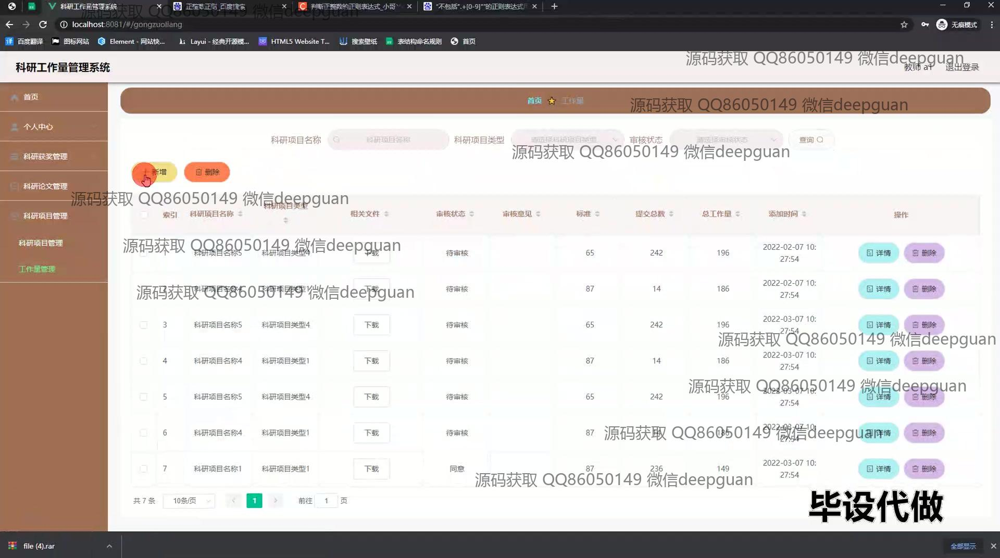

<h1 align="center">科研工作量管理系统的设计与实现</h1>

## 简介
科研工作量管理系统：角色分为管理员和用户；提供科研项目管理、科研获奖管理、科研论文管理、统计分析和权限管理等功能，支持数据的导入与导出，以及用户信息的编辑和审核操作。    --计算机毕业设计源码；毕设源码；java毕业设计源码

## 联系方式

<h3 align="center">获取完整代码与数据库文件 + 微信：deepguan QQ: 86050149 QQ群: 783742310</h3>

<h3 align="center">可帮忙远程部署 包运行成功！提供远程部署、修改代码、设计文档指导、代码讲解等服务！</h3>

## 功能介绍（完整见运行截图）
管理员：主要负责整个科研工作量管理系统的运行与管理。管理员可以通过系统的左侧导航栏进行权限管理、用户管理以及科研项目类型的增删改查操作。此外，还可以设置并管理科研人员的工作量统计，审核科研项目以及导入导出数据，确保数据的准确性与完整性。管理员可以查看和管理所有用户的信息，进行系统维护和调整，确保系统的有效运行与信息安全。

教师：教师在系统中主要用于信息管理和科研工作量的录入。可以通过系统查看个人信息，管理科研项目，录入或修改科研项目细节，包括项目名称、类型、状态及工作量。教师还可以在系统中提交他们的科研工作，包括科研获奖和成果的管理，并查看审核结果。此外，还可以查看科研项目的统计分析，帮助规划和提升自身科研产出。

秘书：秘书角色专注于协助管理和维护科研项目相关的辅助工作。可以在系统中进行科研奖项记录的填报与跟进，协助更新科研项目状态，并参与数据的审核与统计分析。秘书可以管理和编辑与科研项目相关的会议、报告等文档，以及提供论文和科研项目的文件下载服务，为教师和管理层提供支持。

科研人员：科研人员角色涉及管理和浏览个人业务工作量及绩效。可以通过系统提交及更新科研项目的详细情况，包括获奖记录、项目进展及预估工作量等。同时可以通过系统查看科研项目的统计与分析，审阅和下载科研相关的文件资料，支持更高效的科研规划和工作策略的制定。此外，科研人员参与科研项目的录入和阶段性更新，确保数据的时效性与准确性。

## 运行截图

本代码来源于网络,仅供学习参考使用!

